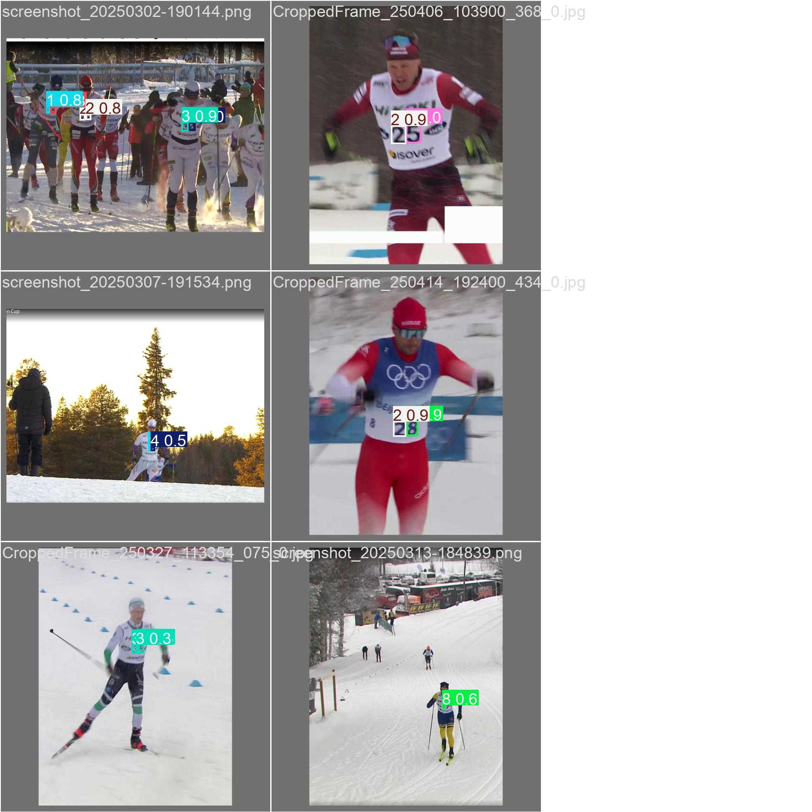
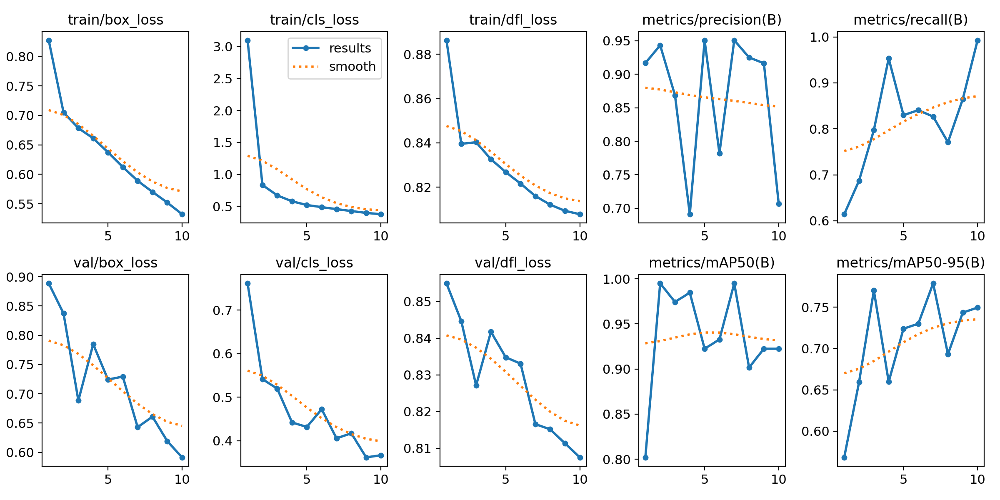

**Description and motivation**

This is a python program that uses the yolo framework for detecting skiers bibs numbers. The training data consists of around 3200 images fetched from competitions streamed on Yle Areena. The yolo model detects digits 0-9 and the post processing method merges closely related bounding boxes for the output.

The program was developed for use in a mobile app. The model should be converted to tfl ite and metadta should be added to the tflite file and the preprocessing and postprocessing should be converted to Java (for use in Android) before deploying to mobile. However, after testing on Samsung S21 Plus the mobel just runs a bit too slow on mobile (~90ms inference and ~30ms pre processing and ~5ms post processing). Both the inference and pre processing (the conversion from Android ImageProxy to Bytebuffer) are hardware accelerated but the inference time is still too slow. The inference would need be quite fast for the post processing to work since the skiers body moves up and down quite fast (the digits are frequently out of sight). Both yolov11-nano and yolov11-small were tested. Yolov11-nano were faster but didnt provide enough accuracy, and yolov11-small was more accurate but run much slower on mobile.

The capability and idea of the program is still shown with the python program in this repo.

**Results of digit detecting yolo model**

As you can see from the validation images and the results graphs the model is training well and reaches quite good results after just a few epochs of training. The validation results also keep decrasing around the same rate as training results, showing that the model is not overfitting. Surprisingly, the model is able to avoid detecting bib numbers on the side of the bib (used in olympics) which would have caused duplicates.

**Dependencies**
-pip install ultralytics

**Training**
-yolo train data=/pathto/customdataFI.yaml model=yolo11s.pt epochs=7 lr0=0.01 cache=False for training

**Usage**
-Replace the runs_path and video_path in yoloVideo.py

-Run python ./yoloVideo.py for postprocessing and inference
